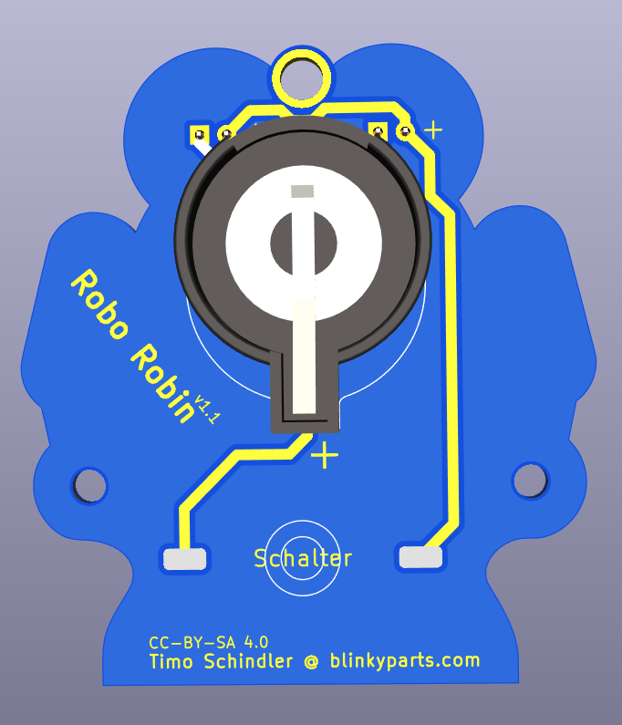

# Robo Robin

- A very simple kit for children aged 4 and over
- Plug-in components for easier soldering
- Circuit visible on the back for explanation
- Compatibility of hands with certain other toys of Danish design

 

- Status: **Complete**
- Difficulty: **1/5**

### Parts List

| Description                   | Quantity |
|-------------------------------|----------|
| RGB LEDs 5mm                  |     2    |
| Button (SMD)                  |     1    |
| CR2032 Battery Holder (THT)   |     1    |
| CR2032 Battery (not included) |     1    |

### Manual
You can find the manual and pictures of every step here: https://github.com/Binary-Kitchen/SolderingTutorial

### Copyright and Authorship

- Board: [CC-BY-SA 4.0](https://creativecommons.org/licenses/by-sa/4.0/) - [Timo from blinkyparts.com](https://shop.blinkyparts.com)
- Axolotl SVG [CC-BY-SA 3.0](https://creativecommons.org/licenses/by-sa/3.0/) - [Robot by iconcheese from thenounproject.com](https://thenounproject.com/icon/robot-1159392/) (We bought a licence, you should also honour the author.)

### Buy Soldering Kits
If you want to buy the parts and PCB for a soldering kit you can find everything here: [shop.blinkyparts.com](https://shop.blinkyparts.com/)
